# 🌲 Hyperion

Hyperion (named after the world’s tallest tree) is an infrastructure-as-code project for creating environments and deploying services with minimal resources. It provides reusable automation and patterns for **local prototyping**, **staging validation**, and **production-ready deployments** on a VPS or cloud provider.  

---

## ❓ Why this project exists?

Hyperion exists to make modern platform operations reproducible without enterprise-scale overhead.

- Reproducible infrastructure and cluster setup from code.
- Consistent local-to-production workflows.
- Safe deployment patterns through GitOps reconciliation.
- Clear operational boundaries per environment.

---

## 🚀 Goals

1. **Minimal Operational Footprint** — Lightweight stack based on K3s, Terraform/OpenTofu, and Ansible.
2. **Safe Delivery Workflows** — GitOps reconciliation with environment-aware overlays.
3. **Developer Velocity** — Fast local bootstrap and validation loops.
4. **Multi-Environment Consistency** — Standardized structure for `local`, `dev`, `test`, `staging`, and `prod`.

---

## ⚡ Quick Start

Prerequisites:
- `tofu` or `terraform`
- `ansible`
- `kubectl`
- `flux`
- `jq`

Local bootstrap:

```bash
make deploy ENV=local
make local-kubeconfig ENV=local
make validate ENV=local
```

Optional for Terraform/Ansible password hashing flow:

```bash
export MICRANTHA_SUDO_PASS='your-password'
```

---
## 📂 Repository Layout

### Public Repository
- 📖 **Documentation** — How to use and extend Hyperion.  
- 🔧 **Reusable Ansible Roles** — Common building blocks for provisioning.  
- ☸️ **Kubernetes Configurations** — Base manifests, kustomizations, and Helm charts.  
- 🔑 **CI/CD Pipelines** — GitHub Actions workflows, with secrets management.  

### Private Repository
- ⚙️ **Cluster Configurations** — Infrastructure definitions for full stacks.  
- 🐧 **K3s Deployment** — Automated with Ansible, provisioned with Terraform.  
- 🏗 **Services** grouped by scope:
  - `org/` → Organization services (`micrantha`)  
  - `user/` → Personal projects (`ryjen`)  
  - `vendor/` → Third-party / vendor-managed services  
- 🌍 **Environments** — Configurations per environment:  
  - `production/`  
  - `staging/`  
  - `development/`  
  - `testing/` (via Vagrant + VirtualBox)  

---

## 🔄 Environments & Deployment

| Environment  | Purpose                                  | Deployment Target          |
|--------------|------------------------------------------|----------------------------|
| Development  | Fast local prototyping                   | Local K3s / Minikube       |
| Testing      | Integration testing w/ libvirt           | Ephemeral VMs              |
| Staging      | Pre-production validation                | VPS / Cloud provider       |
| Production   | Blue/green & canary deployments          | VPS / Cloud provider       |

---

## 🛠 Toolchain

- **Terraform** → Provision cloud infrastructure (VPS, storage, networking).  
- **Ansible** → Automate K3s cluster setup and service deployment.  
- **Kubernetes (K3s)** → Lightweight cluster orchestration.  
- **FluxCD / GitOps** → Continuous deployment to clusters.  
- **Vagrant** → Local testing environment.  
- **GitHub Actions** → CI/CD pipelines with secrets.  

---

## 🛠 Common Commands

| Task | Command |
|------|---------|
| Deploy environment | `make deploy ENV=<env>` |
| Destroy environment | `make destroy ENV=<env>` |
| Validate environment | `make validate ENV=<env>` |
| Initialize Terraform/OpenTofu | `make terraform-init ENV=<env>` |
| Apply Terraform/OpenTofu | `make terraform-apply ENV=<env>` |
| Run Ansible site playbook | `make ansible-run ENV=<env>` |
| Reconcile Flux | `make flux-sync ENV=<env>` |
| Fetch local kubeconfig | `make local-kubeconfig ENV=local` |
| Run role tests | `make test-roles` |


---

## 🧱 Architecture

Hyperion uses a layered workflow:

1. Terraform/OpenTofu provisions infrastructure.
2. Ansible configures hosts and cluster prerequisites.
3. K3s runs workloads.
4. Flux continuously reconciles Kubernetes manifests from Git.

This keeps infrastructure, configuration, and workload state declarative and auditable.

```mermaid
flowchart TB
  classDef actor fill:#f3f6f8,stroke:#51606d,color:#182026,stroke-width:1px;
  classDef control fill:#e8f4f3,stroke:#1f7a6f,color:#0f302c,stroke-width:1.2px;
  classDef infra fill:#f9f2e8,stroke:#b86a25,color:#3e2a14,stroke-width:1.2px;
  classDef runtime fill:#eceffe,stroke:#4a62d8,color:#1a2457,stroke-width:1.2px;
  classDef source fill:#f2ecfb,stroke:#7040b0,color:#2d174b,stroke-width:1.2px;

  Dev[Operator / CI]:::actor --> Make[Make targets]:::control
  Make --> Deploy[ansible/playbooks/deploy-env.yml]:::control
  Deploy --> EnvCommon[playbooks/tasks/env_common.yml]:::control
  EnvCommon --> TF[Terraform env + modules]:::infra
  TF --> Inventory[add_host dynamic inventory]:::control
  Inventory --> Site[ansible/site.yml]:::control
  Site --> Roles[roles: common, security, tailscale, k3s, flux, pocketbase]:::control
  Roles --> K3s[K3s cluster nodes]:::runtime

  Repo[Git source of truth\nk8s-gitops/base + overlays/<env>]:::source --> Flux[Flux controllers\nGitRepository + Kustomization]:::runtime
  Flux --> K3s
  K3s --> Workloads[Namespaces, platform services, app deployments, ingress]:::runtime
```




---

## 🔐 Security

- Keep secrets encrypted (`*.enc.yaml`, `vault.yml`, SOPS-managed files).
- Never commit plaintext credentials.
- Use least-privilege cloud and cluster credentials.
- Prefer remote Terraform state for shared environments.


---

## 🤝 Contributing

1. Create a branch.
2. Make focused changes.
3. Run validation (`make validate ENV=<env>` and relevant tests).
4. Open a PR with environment impact and command output.

Commit style follows Conventional Commits (for example: `feat:`, `fix:`, `chore(ansible):`).

---

## 📄 License

This project is proprietary and closed-source. (c) All rights reserved.
